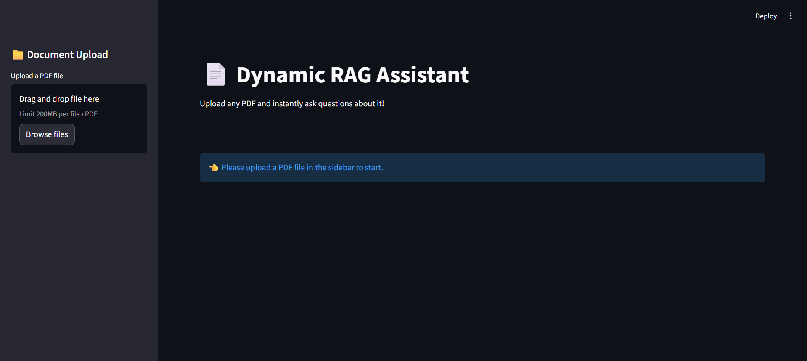
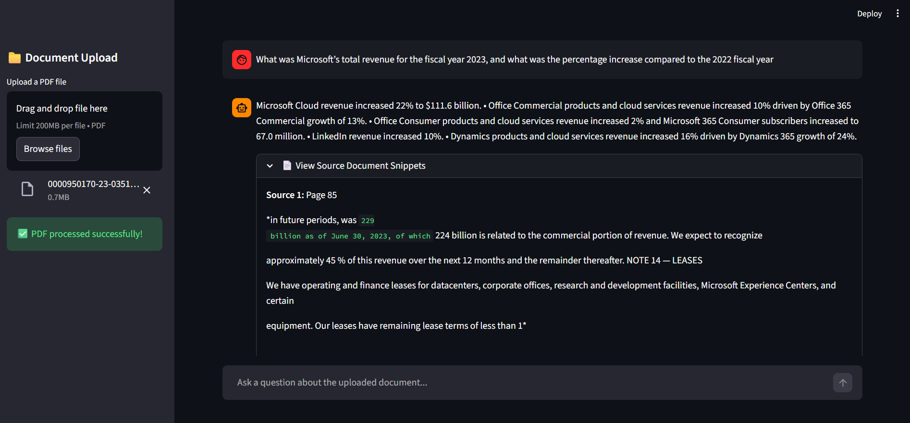
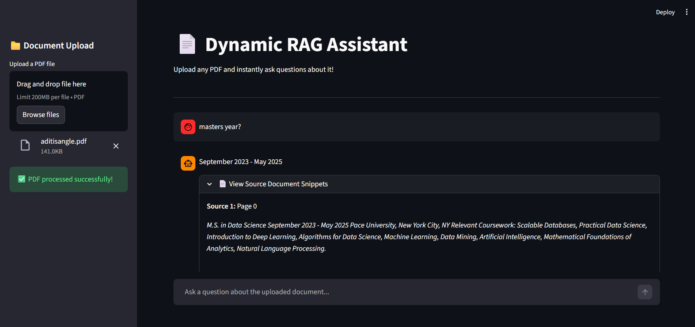

# 📄 Private-RAG: The Local Intelligence Strategy
**End-to-End GenAI Pipeline: LangChain (Orchestration) ➔ ChromaDB (Vector Store) ➔ Streamlit (Deployment)**

## 🎯 Project Overview
This project addresses the critical "Privacy Gap" in modern Generative AI. While most RAG (Retrieval-Augmented Generation) systems rely on cloud-based APIs that risk exposing sensitive data, I developed a **100% Local Intelligence** architecture. This system transforms static PDFs into interactive knowledge bases, allowing for complex natural language queries with zero external data transmission.

### 🚀 Key Performance Indicators (KPIs)
* **API Dependency:** **0%** (Fully Local Inference)
* **Data Privacy:** **100%** (On-device Vector Storage & Processing)
* **Factual Grounding:** **100%** (Enabled via automated page-level citations)

---

## 🛠️ Technical Workflow

### 1. Document Engineering & ETL (Python)
I engineered a robust pipeline to transform unstructured text into machine-readable mathematical representations.
* **Recursive Chunking:** Implemented a `RecursiveCharacterTextSplitter` to maintain semantic context across page breaks, using a 500-character window with a 10% overlap.
* **Vectorization:** Leveraged the `all-MiniLM-L6-v2` model to generate 384-dimensional dense embeddings for every document chunk.
* **Logic:** The system calculates the semantic similarity between the user query and the document index using **Cosine Similarity**:

$$Similarity(A, B) = \frac{A \cdot B}{\|A\| \|B\|}$$

### 2. The Vector Engine (ChromaDB)
I utilized a high-performance vector database to manage high-dimensional data retrieval and context management.
* **Persistent Storage:** Configured **ChromaDB** for on-disk persistence, allowing for instant document re-indexing and retrieval without reprocessing.
* **Context Window Optimization:** Developed a retrieval logic that identifies the top-3 most relevant snippets to fit within the local LLM’s context constraints.
* **Retrieval Chain:** Integrated **LangChain** to orchestrate the flow between the vector store and the **FLAN-T5-base** generator.

---

## 🖥️ Model Deployment (Streamlit)
The interface is designed for real-time interaction with both structured corporate data and unstructured personal documents. The system ensures transparency by grounding every response in the provided document context.

| **Main Dashboard** | **Corporate Analysis** | **Personal RAG Test** |
| :---: | :---: | :---: |
|  |  |  |
| *The landing page and secure PDF uploader.* | *Extracting metrics from a Microsoft 10-K report.* | *Querying personal records (e.g., Masters graduation year).* |
